# NextJS Front End

Tutorial next js basic requestan Falah

---

### Memulai membuat NextJS

```
npx create-next-app@latest
```

Ini adalah command untuk bikin NextJS, gausah ngide, ini udah yang paling bagus

### Menjalankan NextJS

```
npm run dev
```

Ini buat jalanin NextJS, bisa diotak atik di `package.json`. Atau misal mau jalanin di port lain selain 3000 karena suatu alasan, bisa tambah `-- -p <port>` misal

```
npm run dev -- -p 3001
```

Nanti langsung aja ke browser misal `localhost:3000` nanti langsung keliatan

---

### React di NextJS

NextJS itu juga react, jadi apapun yang ada di react bisa dilakuin di NextJS. Bedanya dimana? NextJS langsung bisa front-end back-end out of the box. Sama beberapa config lainnya yang bisa di setting, misal router, ts, atau tailwind CSS yang langsung ditawarin waktu instalasi.

Jadi kalau udah bisa react, untuk front-end harusnya gampang soalnya sama aja. Malah kurasa lebih gampang yh soalnya gaperlu install manual router, ts, tailwind, sama config laman 404, loading, dll.

---

### ShadCN/ui

<div align="center">
    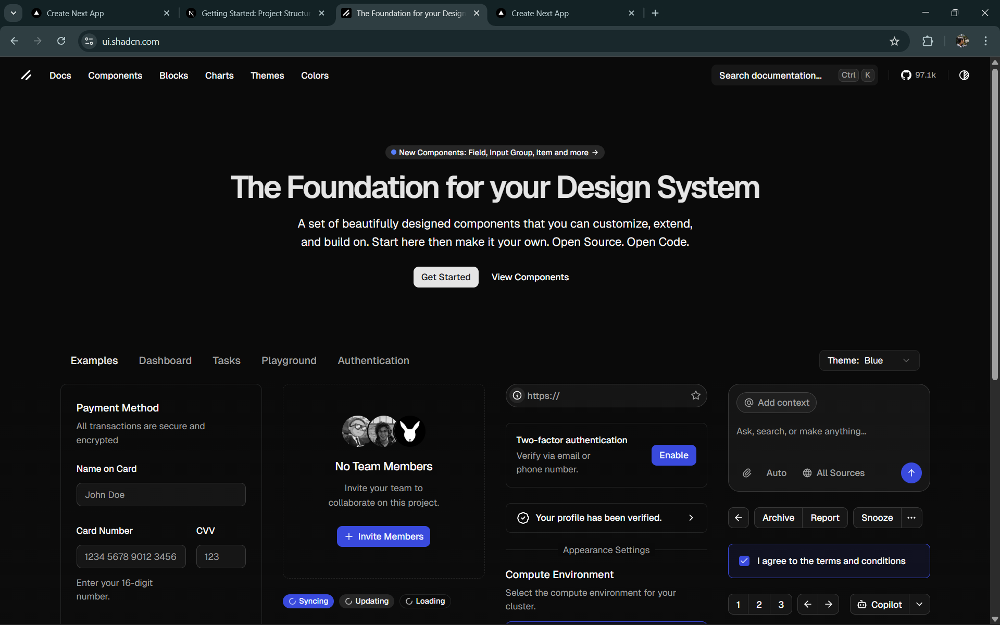
</div>
Ini kurasa penting, alesannya karena nanti gampang kalau mau pake reusable component, percaya deh. Untuk setting warna juga disediain, misal `color-primary` atau `color-secondary` sama banyak library yang bisa diubah sendiri, gak kayak bootstrap jadul nyebai.

Untuk instalasi, bisa ke halaman ShadCN langsung di: https://ui.shadcn.com/ atau langsung ke cli

```
npx shadcn@latest init
```

Nanti langsung ada yang berubah di `package.json`, `globals.css`, dll. Misal kalau mau nambah warna-warna, bisa ke `globals.css` dan ubah aja warna-warna disitu. Misal aku ambil contoh mau ubah primary color sama secondary color, langsung ke line 54 sama 56, ubah aja ke warna yang diinginkan. Cara pakainya nanti kutunjukin.

Untuk nambahin komponen bisa browse aja sebetulnya di: https://ui.shadcn.com/docs/components kukasih contoh nambahin button

```
npx shadcn@latest add button
```

Nanti bakal kebikin folder components/ui/button.jsx yang bisa di custom btw. Caranya nanti yh. Coba sekarang masuk ke demo ShadCN.

---

### Demo ShadCN

Disini kita objektifnya nyoba untuk bikin halaman baru di root "/" untuk nampilin buttonnya. Navigasi ke app/page.js kemudian hapus segala konten yang ada dan paste ini

```
import { Button } from "@/components/ui/button";
import React from "react";

const page = () => {
  return (
    <div className="w-full h-screen flex flex-col items-center justify-center">
      <Button>Hello World</Button>
    </div>
  );
};

export default page;
```

Save dan lihat di `localhost:3000` hasilnya seharusnya gini

<div align="center">
    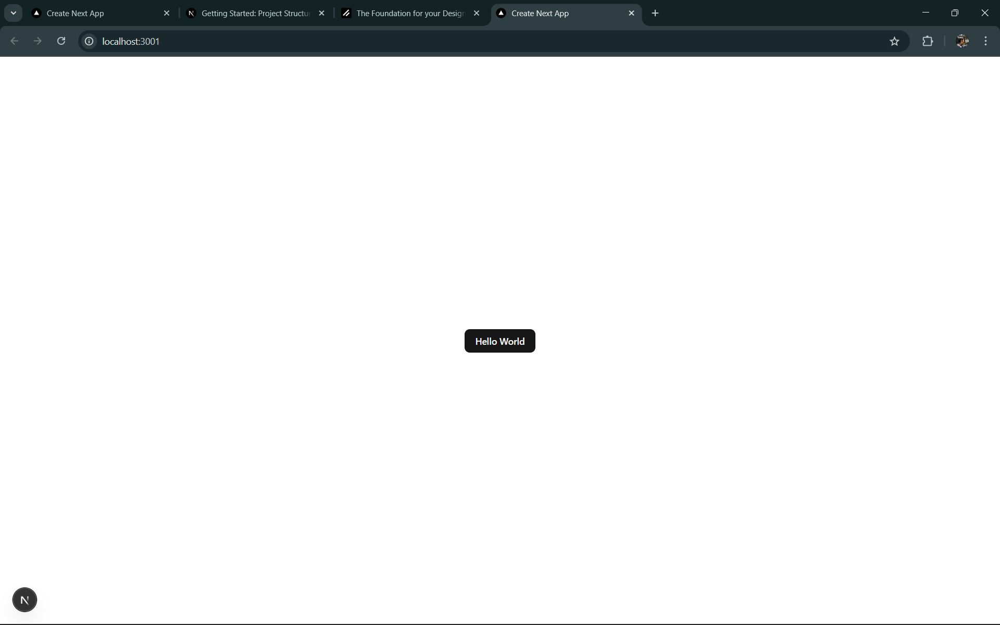
</div>
Udah keliatan belum maksudnya gimana? Kita cuman butuh import button aja, pake dengan `<Button />` langsung bisa muncul. Terus warna sama desainnya? Lanjut kita ke materi warna yh.

---

### Pewarnaan di globals.css

Kita praktek aja daripada teori terus, langsung ke `globals.css` line 54, yang ada --primary, coba ubah jadi warna apa aja bebas, misal aku mau `--primary: oklch(62.358% 0.20636 255.147);` langsung save aja, liat ke browser. Hasilnya harusnya begini

<div align="center">
    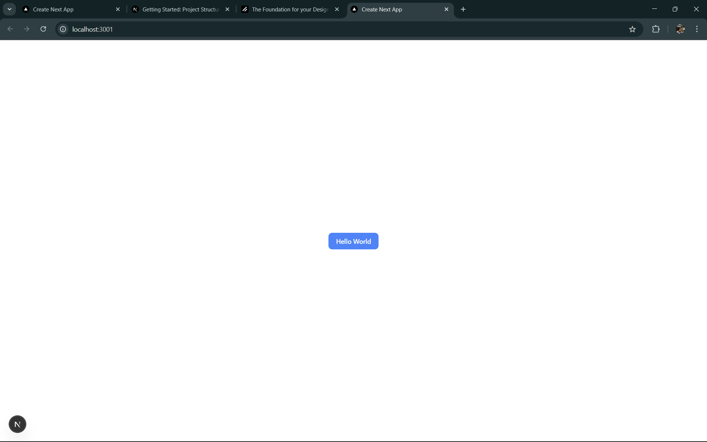
</div>

Lihat warna buttonnya ganti jadi biru. Lho kok bisa? iya soalnya kalau kita hover ke `<Button />` dan ctrl+click, kita bisa liat isi dari html dan tailwind CSS dari button itu. Cek bagian `variant: {default: "bg-primary text-primary-foreground hover:bg-primary/90"}` Maksudnya adalah komponen `<Button />` menggunakan background `bg-primary` yang mengambil warna dari `--primary` yang udah ditentukan sebelumnya. Masuk akal gak? Coba mainin aja `globals.css`.

Kita juga bisa bikin komponen lain dengan menggunakan warna yang udah kita tentuin tadi. Misal aku mau bikin teks yang pake color primary sama span color secondary. Copy kode ini lalu tambahkan di bawah `app/page.js`

```
<p className="text-primary">
    Lorem ipsum <span className="text-secondary">dolor sit</span> amet
</p>
```

Ubah juga warna dari `--secondary` by now harusnya kalian udah tau maksudku, kalau gatau dan kita lagi sesi tatap muka, bisa interupsi aja

```
--secondary: oklch(54.045% 0.22179 29.223);
```

Hasilnya harusnya begini kalau bener

<div align="center">
    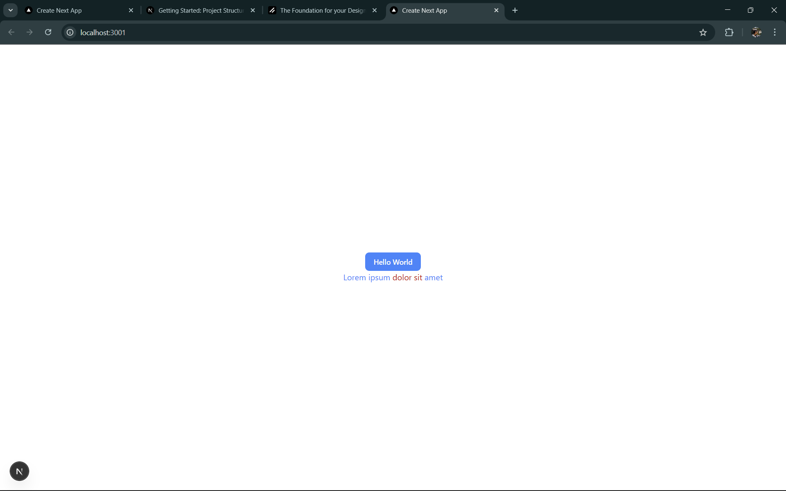
</div>

Gunakan warna sesuai kebutuhan, bisa aja pakai lebih dari 2 warna, tinggal tambahin aja misal `--ternary: oklch(73.533% 0.24506 141.604);` ngerti lah mesti tapi jangan lupa update `@theme inline` juga, tambahin ini `--color-ternary: var(--ternary);`. Eksplore aja ya gausah diingetin harusnya tawu.

---

### Tailwind CSS

Bootstrap terlalu tua dan aku gak suka, jadinya kita pake tailwind CSS biar kekinian dan kece. Kalian udah pernah pake bootstrap jadinya seharusnya udah tau lah ya cara kerjanya bootstrap. Tailwind ini sama aja sebetulnya, cuman lebih enak karena dia itu lebih fleksibel, kalian tadi udah ngubah ngubah `globals.css` itu sebetulnya ngerubah tailwind config juga. Penggunaannya sama kayak bootstrap, taruh aja di `className (kalau di Laravel/framework lain pake class)` untuk stylingnya. Coba kita inget di bagian sebelumnya, terdapat kode

```
<p className="text-primary">
    Lorem ipsum <span className="text-secondary">dolor sit</span> amet
</p>
```

Pada bagian `className` terdapat `text-secondary` yang mana adalah styling untuk warna teks. Coba pada `<div>` di halaman `app/page.js` kita tambahkan background, mungkin dengan menambahkan background berwarna ungu muda? `className` yang akan kita gunakan adalah `bg-violet-300` langsung saja praktek

```
const page = () => {
  return (
    <div className="w-full h-screen flex flex-col items-center justify-center bg-violet-300">
      <Button>Hello World</Button>
      <p className="text-primary">
        Lorem ipsum <span className="text-secondary">dolor sit</span> amet
      </p>
    </div>
  );
};
```

Lihat pada value `<div>` paling belakang, terdapat kode untuk background ungu muda. Mari kita lihat hasilnya ya a dick a dick

<div align="center">
    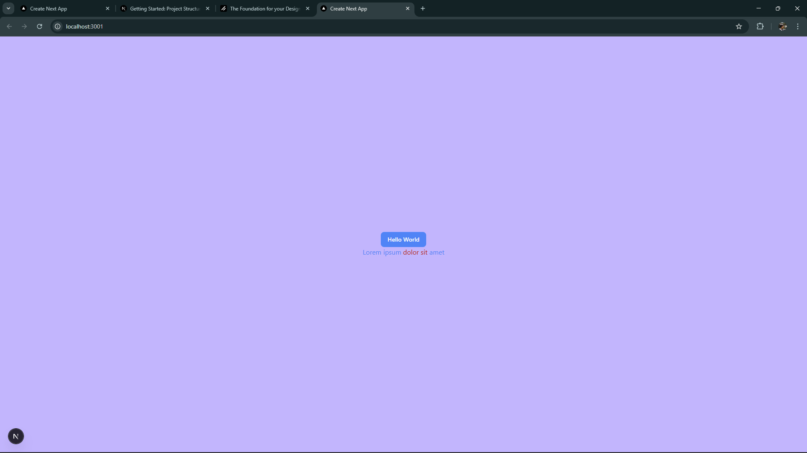
</div>

Backgroudnya ganti jir jadi ungu. Ngerti kan kalau `bg` itu singkatan background? Jadi `bg-violet-300` itu artinya jika secara literal "background warna violet dengan pencahayaan? 300 (semakin besar semakin gelap). Gitu pokoknya.

Mari kita perhatikan value `<div>` yang lainnya coba, `<div className="w-full h-screen flex flex-col items-center justify-center bg-violet-300" />`

1. w-full: width full (100%)
2. h-screen: height to screen (100vh)
3. flex: display to flex
4. flex-col: flex orientation column
5. items-center: align items to center
6. justify-center: justify content to center
   Hasilnya adalah tombol jadi di tengah, gitu doang

Untuk melihat dokumentasi lengkap Tailwind CSS, kunjungin aja https://tailwindcss.com/ disana ada banyak yang bisa dieksplorasi

---

### NextJS best practice

Maksudnya disini kita bisa pake komponen-komponen bawaan NextJS yang udah dioptimasi, contoh paling sederhananya `<Image />` dan `<Link />`. Maksudnya gimana? maksudnya tuh daripada pake bawaan html yang kuno dan tidak teroptimasi, kita bisa pake NextJS komponen yang udah ada fitur misal lazy loading, caching, bla bla aku gak tawu banyak, pokoknya gitu aja dah. Praktek? gas

Import foto dulu, misal aku pake foto /foto.jpg, bikin aja gini di dalem div utama

```
import Image from "next/image";

...

<Image src={"/foto.jpg"} alt="foto" width={400} height={400} />
```

Gitu doang, bedanya di tagnya aja dari `` jadi `<Image />` tapi jangan lupa importnya ya. Kalau mau liat perbedaannya, tinggal inspect aja `ctrl + shift + i`, hasilnya gini

<div align="center">
    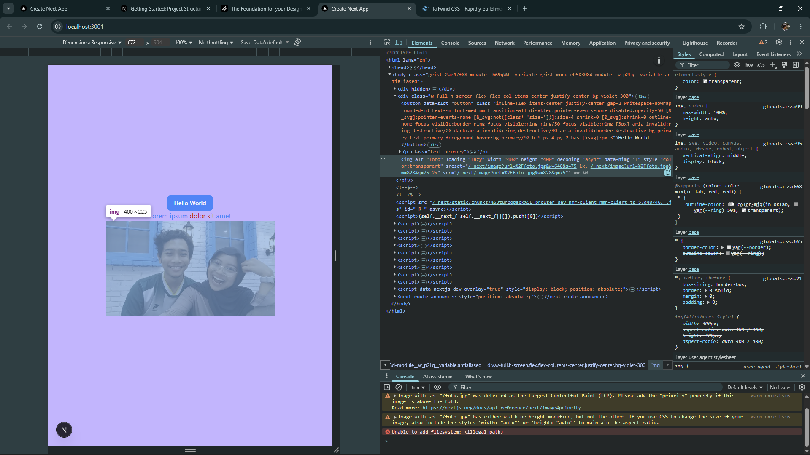
</div>

Kalau link ya sama aja, coba gini deh tambahin

```
import Link from "next/link";

...

<Link href={"https://afif.dev"} className="text-white">
    Web Afif
</Link>
```

Jangan lupa import yah. Lihat aja nanti hasilnya, gausah ada foto gpp yh.

---

### Struktur folder

NextJS juga punya struktur folder, tapi tergantung milih pake `src/` atau enggak ya waktu install NextJS. Tapi kurleb yang penting itu ada:

1. public/ ini untuk naruh foto biasanya, untuk akses tinggal ketik "/" doang
2. app/ ini tempat front end aplikasi kalian
3. components/ ini tempat untuk naruh modul front end
4. lib/ ini tempat untuk server action atau API biasanya, atau apalah yang pakai .js/.ts sering tanpa front end

Jadi umumnya naroh foto itu di public/ terus komponen di components/ yang dibikinin sama shadCN langsung. lib/ gapernah kuperhatiin sih lupa, pernah bikin sendiri atau tiba tiba nongol aja kayak yang sekarang ini. Mari kita bahas folder app/ aja karena ini yang penting.

---

### Direktori app/

NextJS atau react pada umumnya, naroh file front end biasanya di app/ dan karena ini NextJS udah di config biar gampang gak kayak react jadul atau vite atau apalah, jadinya untuk pem-folder-an itu gampang routingnya. Maksudnya gini, biasa kita kalau dulu bikin web pake php itu straightforward banget, misal aku punya:

```
t4nyimpen/
├── index.php
└── folder1/
    ├── folder3/
    │   └── graph.php
    ├── folder4/
    │   └── data.php
    └── index.php
```

Maka kalau aku mau ngakses data.php, anggep aja `t4nyimpen` jadi localhost, kita tinggal ke `http://localhost/folder1/folder4/data.php` ya gak? Kalau cuman `http://localhost` doang? yang muncul bakal index.php di folder `t4nyimen` ya gak? Terus gimana kalau aku nulis `http://localhost/folder1/` apa yang bakal keluar? Harusnya tau sih udah pernah soalnya.

Nah sekarang ganti ke NextJS, khususnya pada app/

```
folder/
├── public/
└── src/
    └── app/
        ├── dashboard/
        │   └── page.js //Kode 2
        ├── profile/
        │   └── page.js //Kode 3
        ├── layout.js
        └── page.js //Kode 1
```

Ini tuh sebenernya sama aja kayak yang biasa php tadi, cuman instead of `index.php`/`index.html`, kita pake `page.js`, dan si `app/` bakal jadi si `localhost` -nya, ngerti gak? Jadi kalau kita input `http://localhost` yang keluar bakal `page.js` dengan Kode 1, kalau `http://localhost/dashboard` yang keluar bakal `page.js` Kode 2, ngerti kan ya? gampang sih. Praktek?

Buat dua folder, "dashboard" dan "profile" yang masing-masing memiliki `page.js` -nya sendiri. Ngerti lah ya harus ngapain gak usah dikasih gambar, toh udah ada struktur foldernya diatas. Isikan dengan kode ini

```
import React from "react";

const page = () => {
  return (
    <div className="w-full h-screen flex flex-col items-center justify-center bg-green-300">
      <p>Dashboard</p>
    </div>
  );
};

export default page;
```

Tapi kalau untuk `profile/page.js` ganti background dengan warna lain dan paragraph dengan "Profile". Cek hasilnya pada `http://localhost/dashboard` dan `http://localhost/profile` kalau benar hasilnya bakal gini

<div align="center">
    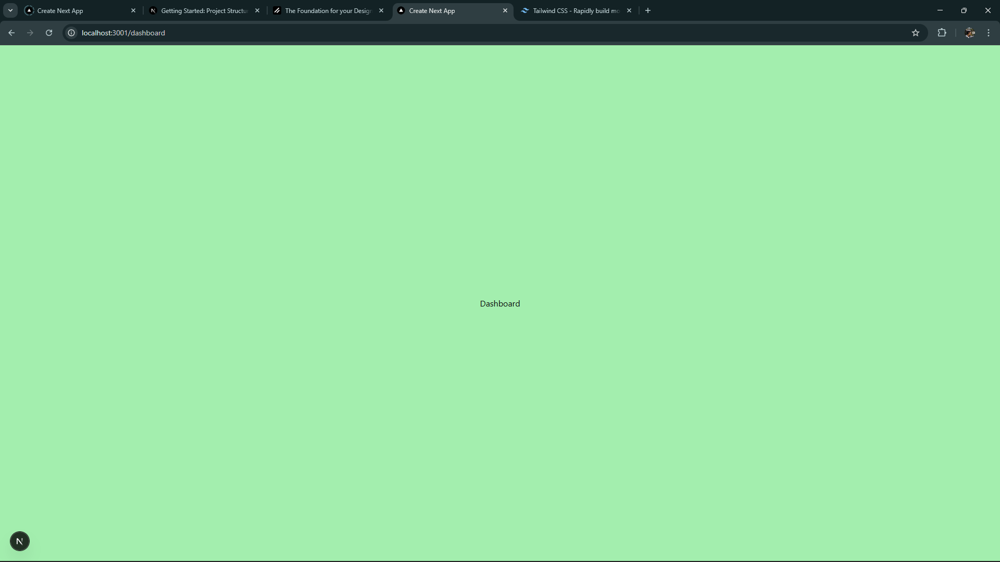
</div>
<div align="center">
    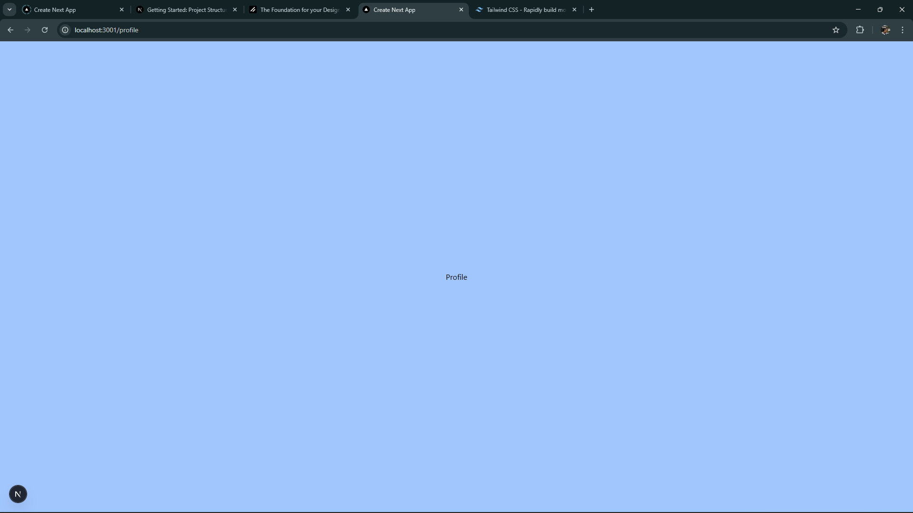
</div>
Ngerti lah ya gausah lama lama, biar kita bisa lanjut ke materi berikutnya

---

### 404

Ini buat bikin halaman punya indikator kalau gak ketemu, kayak error 404 page not found gitu lah, bikin aja sekali nanti langsung bisa buat segalanya. Gak wajib, cuman bagus aja. Silakan bikin `not-found.js` di direktori `app/` lalu isi kode kayak gini

```
export default function NotFound() {
  return (
    <div className="w-full h-screen flex flex-col items-center justify-center">
      <p>404, gk ketemu</p>
    </div>
  );
}
```

Save, lalu ke browser ketik url ngawur, misal `http://localhost:3000/icikiwir`, hasilnya bakal gini

<div align="center">
    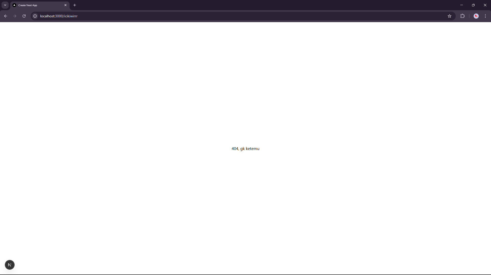
</div>

Berlaku untuk semua route yh gak cuman root doang

---

### React Hooks

Disini kita bakal belajar dua react hooks yang paling penting dan paling sering digunakan untuk aplikasi NextJS, yaitu useState dan useEffect.

useState() hooks digunakan untuk nyimpen data, kalau useEffect biasanya untuk ngatur side effect apabila terdapat perubahan pada dependency-nya. Maksudnya gimana? langsung praktek aja lah gatau juga jujur jelasinnya gimana. Buat dir `hooks/page.js` dalam dir `app/`. Kemudian isikan ini

```
"use client";
import React from "react";

const page = () => {
  let name = "icikiwir";
  const handleSubmit = (e) => {
    e.preventDefault();
    name = e.target.name.value;
    console.log(name);
  };
  return (
    <div className="w-full h-screen flex flex-col items-center justify-center">
      <form onSubmit={handleSubmit}>
        <input
          type="text"
          name="name"
          defaultValue={name}
          className="border p-2"
        />
        <button type="submit" className="border">
          Submit
        </button>
      </form>
      <p className="mt-4">Name: {name}</p>
    </div>
  );
};

export default page;
```

save, buka konsol, lalu ganti nama menjadi apapun yang diinginkan, lalu submit. Nama yang sudah diupdate tidak akan terlihat terupdate padahal di console sudah menunjukkan nama sudah terganti. lihat contoh berikut

<div align="center">
    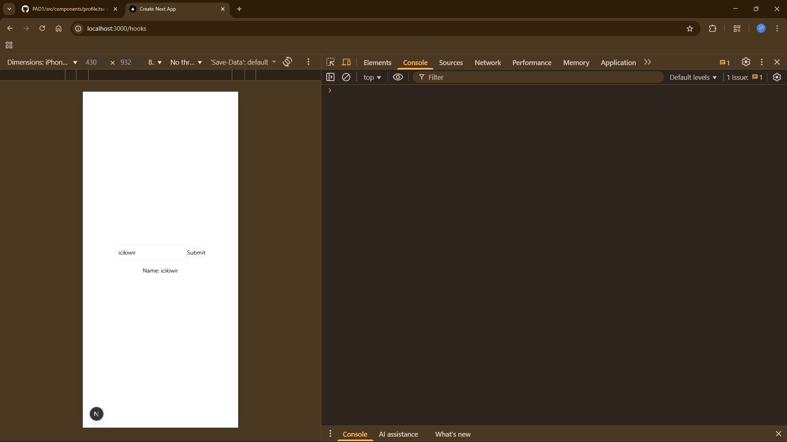
</div>
sebelum disubmit
<div align="center">
    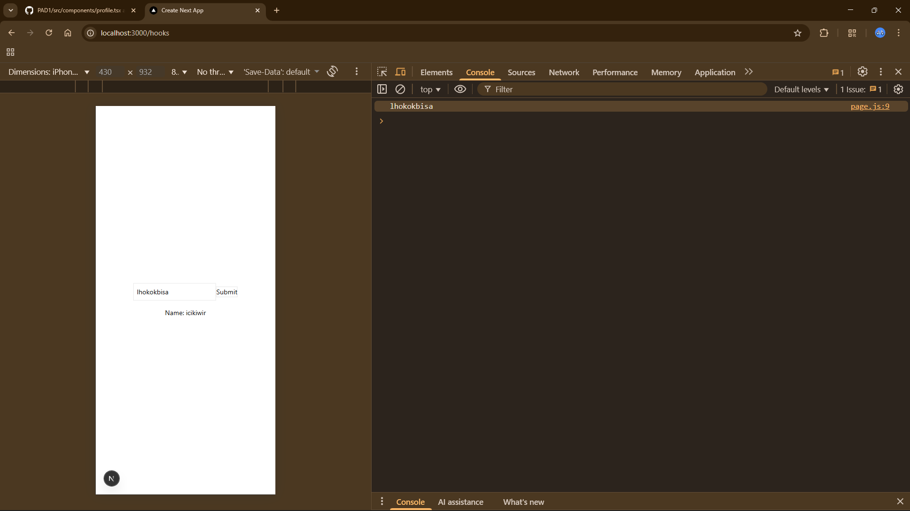
</div>
setelah disubmit, nama belum ganti. Hal ini disebabkan oleh react yang tidak me re-render halaman apabila terjadi submit data sehingga data yang sudah disubmit tanpa perlakuan khusus akan tidak akan terlihat. Solusinya gimana? pake useState, ubah kode menjadi begini

```
const [name, setName] = React.useState("Afif");
const handleSubmit = (e) => {
  e.preventDefault();
  setName(e.target.name.value);
  console.log(name);
};
```

lalu coba jalankan, hasilnya akan seperti ini

<div align="center">
    
</div>
sebelum disubmit
<div align="center">
    
</div>
setelah disubmit, hasilnya akan berubah menjadi apapun yang kita submit, pada gambar dari nama "Afif" berubah menjadi "Nida". Hal ini sudah benar, namun terdapat bug yang dapat dilihat pada console. Yaitu nama yang ter-console adalah "Afif" padahal seharusnya "Nida". Hal ini disebabkan oleh useState yang asinkron, sedangkan "console.log" sinkron, bahasa gampangnya sebelum useState selesai mengganti nama, "console.log" udah ngeprint nama terakhir, anggepannya keduluan sama "console.log" gitu. Solusinya gimana pakdhe? pake useEffect.

useEffect digunakan buat nampilin suatu efek apabila dependensinya terupdate. Jadi intinya dia bakal nunggu sampe `nama`-nya bener bener keganti baru dia jalanin console.log nya. Ubah aja kodenya jadi begini

```
const handleSubmit = (e) => {
    e.preventDefault();
    setName(e.target.name.value);
  };
  React.useEffect(() => {
    console.log(name);
  }, [name]);
```

liat aja hasilnya, tapi ada bug sih sebetulnya karena nama yang kita tentuin di awal langsung ke log, tapi se-ngehku ga ngaruh samsek. Ku demo in aja deh malas sudah capek. Jadi intinya tu useState tu ngerender ulang, useEffect tu ngasih side effect. Pokoknya gitu.

---

### Client dan Server

Kalau kalian notice, aku ada ngasih `"use client";` di beberapa file, beberapa yang lain enggak. Intinya tu to, kalau kalian lagi slicing tanpa ada backend-nya, kalian bisa pake `"use client";` untuk bikin halamannya di-render di browser dan bukan di server. Umumnya NextJS initally bikin semua jadi `"use server";` yang mana itu untuk backend, tapi karena ini tutorial front-end jadinya gausah, pake `"use client";` aja pokoknya kalo front-end.

---

### Media Query

@media di NextJS udah dibikin gampang kalau nginstall tailwind, di tailwind sendiri mengusung mobile-first jadi kalian diharapkan untuk bikin mobile dulu daripada dekstop, tapi kita tau itu bullshit ya.

Jadi maksudnya mobile-first yang perlu kita perhatikan itu cara tailwind nyiapin media query. Tailwind punya built in media query dengan ukuran `sm:` utk >small `md:` utk >medium `lg:` untuk large `xl:` untuk lebih gede lagi and so on. Jadi sm: tu bukan untuk small screen, tapi lebih besar dari small screen.

Kita coba praktik yh, bikin kode ini di `app/mq/page.js`

```
import React from "react";

const page = () => {
  return (
    <div className="w-full h-screen flex flex-col justify-center">
      <div className="w-full sm:w-8 h-[5vh] bg-red-500" />
      <div className="w-full md:w-32 h-[5vh] bg-green-500" />
      <div className="w-full lg:w-96 h-[5vh] bg-yellow-500" />
      <div className="w-full xl:w-2xl h-[5vh] bg-blue-500" />
    </div>
  );
};

export default page;
```

Aku akan menjelaskan maksud dari salah satu tailwind diatas, `w-full sm:w-8 h-[5vh] bg-red-500` maksud dari kode ini adalah, default `w-full`(`width: 100%`) jika melebihi ukuran `sm:`(melebihi ukuran hp) maka jadikan panjangnya `40rem`, `h-[5vh]` artinya tinggi `5vh`, `bg-red-500` artinya background warna merah kode 500.

hasil dari kode diatas bisa dilihat disini

<div align="center">
    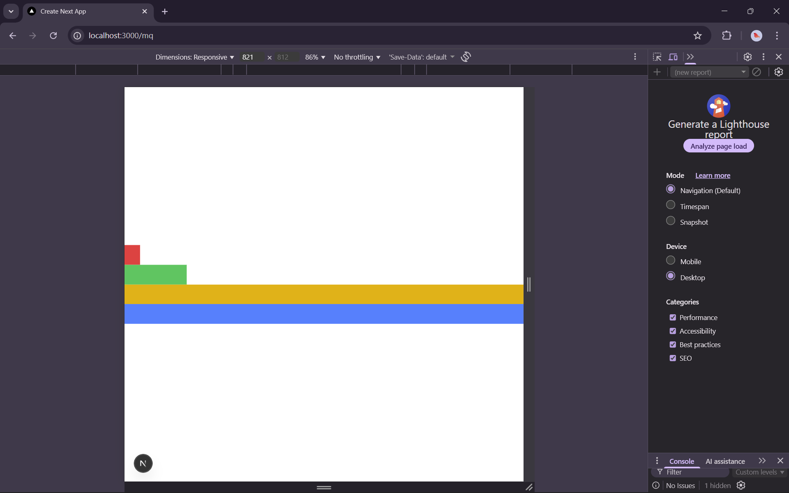
</div>
Karena `width` dari halaman diatas masih dalam batas lg:, maka merah dan hijau masih akan tetap pada ukurannya sedangkan kuning dan biru berubah menjadi width 100%

---

### Keyframe

Keyframe di NextJS/React agak tricky, kita define sendiri di `<style jsx>` contohnya gini

```
import React from "react";
import asteriskImg from "@/../public/assets/asterisk.png";
import Image from "next/image";

function Asterisks() {
  return (
    <>
      <Image
        src={asteriskImg}
        alt="Asterisks"
        style={{
          animation: "floating 2.8s ease-in-out infinite, rotateAnimation 3s linear infinite, scaleAnimation 4s ease-in-out infinite",
        }}
      />
      <style jsx>{`
        @keyframes floating {
          0%, 100% {
            transform: translateY(0px) rotate(4deg);
          }
          50% {
            transform: translateY(-12px) rotate(4deg);
          }
        }

        @keyframes rotateAnimation {
          0% {
            transform: rotate(0deg);
          }
          100% {
            transform: rotate(360deg);
          }
        }

        @keyframes scaleAnimation {
          0% {
            transform: scale(1);
          }
          50% {
            transform: scale(1.2);
          }
          100% {
            transform: scale(1);
          }
        }
      `}</style>
    </>
  );
}

export default Asterisks;
```

Si `<Image>` ini gambarnya, konten di dalemnya sebenernya basic aja, cuman ada bagian `style={{bla, bla, bla}}` yang emang agak kompleks karena biasa kalau di react itu pake library kayak framer motion, aos, dll tapi aku yo gak suka animasi aneh aneh kecuali Falah, jadi jarang banget make jujur aja jadi bukan expertise ku.

Yang style tadi itu make css biasa ya, kalau di tailwind setauku gaada yang kompleks dan random gitu, jadi mau ga mau pake `<style jsx>` tadi. Pokoknya kalian harus punya fundamental animasi css biasa yang mana aku ga begitu punya sih kwkwkkwwk.

Ngomong-ngomong disini gaada demo soalnya aku males, kalian bisa ganti yang `asterisk` tadi jadi nama foto kalian, bebas, mau pake fotoku ya gaskan aja, mungkin aku demoin kalau tatap muka.

## Mulai Coding

### Conditional rendering

Materi kali ini kita coba conditional rendering, misal kalau ada user belum login, kita tampilin data A, kalau udah login tampilin data B. Misal navbar belum login cuman ada logo perusahaan sama tombol login, kalau udah login tambahin misal profile, dashboard, dll. Langsung praktik aja ya, bikin direktori dan file baru namanya `conditional-rendering/page.js` isi dengan

```
import React from "react";

const page = () => {
  const isLoggedIn = false;
  return (
    <div className="w-full h-screen flex flex-col items-center justify-center">
      {isLoggedIn ? <p>Welcome back!</p> : <p>Please log in to continue.</p>}
    </div>
  );
};

export default page;
```

Ini secara simpel ya, dicoba dulu aja, toggle manual dari `isLoggedIn = false` ke `true` hasilnya harusnya begini kalau false:

<div align="center">
    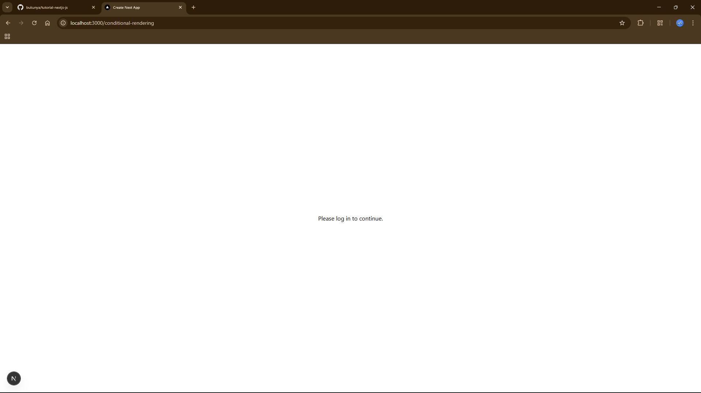
</div>
Sedangkan kalau true:
<div align="center">
    
</div>

Dapet gak konsepnya? maksud dari `{isLoggedIn ? <p>Welcome back!</p> : <p>Please log in to continue.</p>}` bahasa literalnya tu gini `{apakah sudah login ? tampilkan ini bila sudah : tampilkan ini jika belum}` atau `{kondisi ? show if true : show if not}` Jadi gimana kasus login tadi bila diimplementasikan ke dunia nyata? Sebelum masuk secara rill, mungkin aku mau ngasih tau best practiceku yaitu "Try to not hard code data"

### Bermain dengan data

Di dunia nyata (jir dunia nyata), kita biasa ngambil data dari API, formatnya json atau apalah, bentuknya tu misal gini

```
const data = {
  "food" : [
    "rendang padang",
    "rendang manis jawir",
    "icikiwir"
  ],
  "drink" : {
    "healthy" : [
      "bebsi",
      "point coffee",
      "water"
    ],
    "shit" : [
      "vodka",
      "beer"
    ]
  }
}
```

Untuk ngaksesnya nanti misal kita mau ngambil "rendang padang", kita bisa pake `data.food[0]` ngerti kan kayak di PPBO atau python dulu? Udah keliatan belum maksudku dimana? Gini aja deh, tambahin

```
{data.food.map((item) => (
  <p key={item}>{item}</p>
))}
```

di bawah yang `isLoggedIn`, hasilnya harusnya kayak gini

<div align="center">
    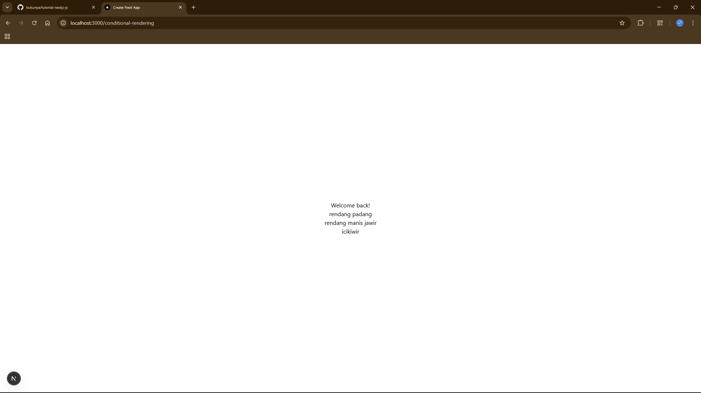
</div>

Semua makanan yang ada bakal ditampilin, kayak `@foreach` di php, atau di python gini deh

```
foods = ["sad food", "happy food", "regular food"]
for food in foods:
  print(food)
```

gitu, paham kan? udah keliatan belum kalau bakal kita apain kalau kita gabung conditional rendering sama bermain dengan data? paham? lanjut

### Fitur login dummy gabungan conditional rendering sama bermain dengan data

Kita tambahin konten `conditional-rendering/page.js` ya, aku mau nambah data ini di dalem fungsi export default

```
const blmLogin = {
  "gambar" : "public/foto.jpg",
  "login" : "#"
}

const sdhLogin = {
  "gambar" : "public/foto1.jpg",
  "dashboard" : "/dashboard",
  "profil" : "/profil",
  "logout" : "#"
}
```

Ganti seluruh return dari fungsi export default menjadi

```
<div className="w-full h-screen flex flex-col items-center justify-center">
  <Image
    src={isLoggedIn ? sdhLogin.gambar : blmLogin.gambar}
    width={400}
    height={400}
    alt="foto"
  />
  {isLoggedIn ? (
    <div>
      <Link href={sdhLogin.dashboard}>Dashboard</Link>
      <Link href={sdhLogin.profil}>Profil</Link>
      <Link href={sdhLogin.logout}>Logout</Link>
    </div>
  ) : (
    <Link href={blmLogin.login}>Login</Link>
  )}
</div>
```

Jangan lupa importnya ya, ada dua, `Image` sama `Link`. Toggle manual aja `isLoggedIn`-nya hasilnya kalau true

<div align="center">
    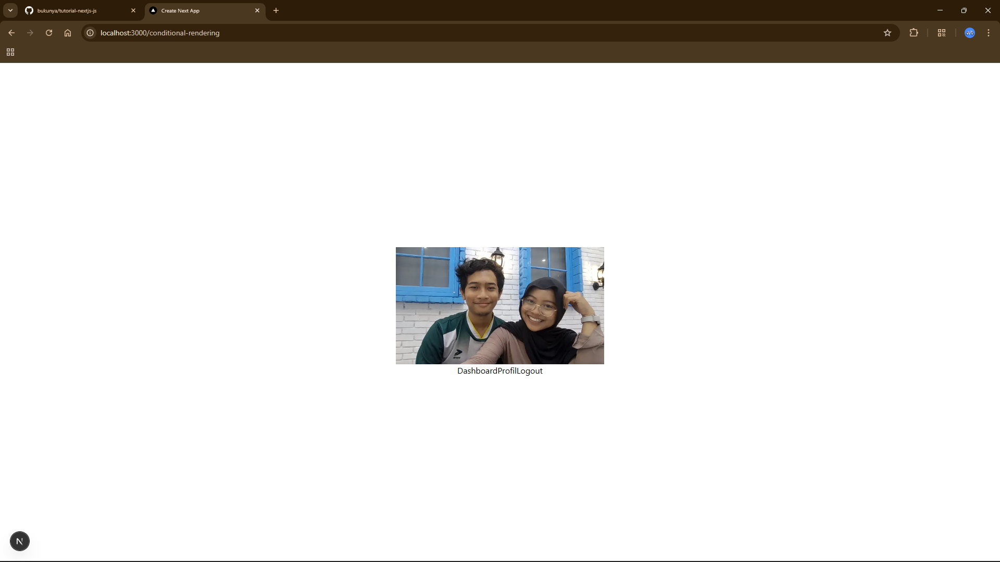
</div>
Kalau false
<div align="center">
    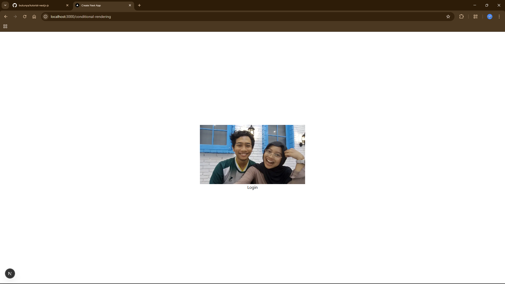
</div>

Implikasi dunia nyatanya gimana king? gini, kalau misal kalian pake OAuth atau bikin session sendiri, misal ambil kasus OAuth dari https://authjs.dev nanti untuk manggil session bisa pake

```
async function autentikasi() {
  const session = await auth();

  if (session) {
    const fetchdata = await prisma.user.findMany()

    return (
      <p>{fetchdata.username}</p>
      <p>{fetchdata.createdAt}</p>
    )
  }

  return null;
}
```

Intinya bakal ngefetch data kalau ada session gitulah, gak ngerti? nanti ku-demo-in pake project gwejh sendiri

### Navbar custom

Disini bakal kubikinin navbar custom, requestannya falah. Jadi dia mau kayak navbar custom ted https://techenthusiastday.com yang mana aku juga developer front end disitu. Jadi basicnya dulu ya.

Langkah dari navbarnya itu dimulai dari tampilan desktop dulu, mari kita bikin page khusus navbar di `app/nav-demo/page.js`

```
import Link from "next/link";
import React from "react";

const page = () => {
  return (
    <div className="w-full h-screen bg-blue-200">
      {/* Navbar */}
      <div className="w-full h-16 bg-white flex items-center justify-center px-4">
        <div className="container flex flex-row justify-between items-center mx-auto">
          <h1 className="text-2xl">My Navbar</h1>
          <Link href="/" className="">
            Home
          </Link>
          <Link href="/" className="">
            Home1
          </Link>
          <Link href="/" className="">
            Home2
          </Link>
        </div>
      </div>
    </div>
  );
};

export default page;
```

cek hasilnya harusnya gini

<div align="center">
    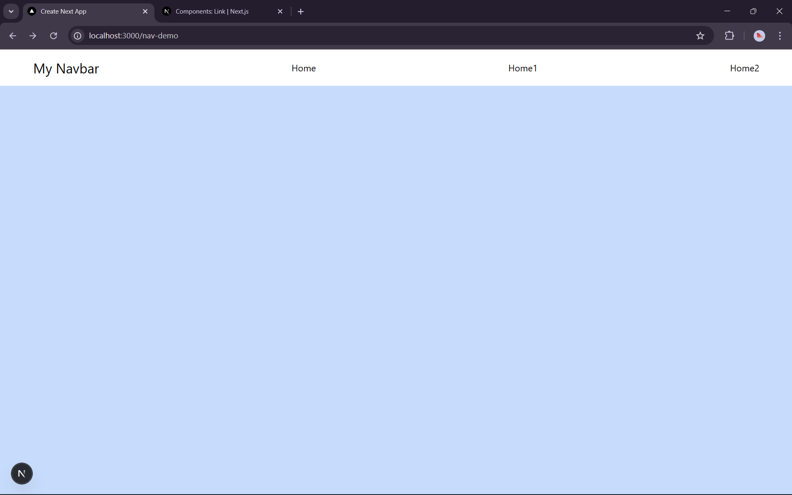
</div>

Tujuan saat ini adalah untuk membuatnya jadi kecil kalau udah di scroll kayak navbarnya TED. Pertama tambahin scroll listener dulu

```
useEffect(() => {
    const handleScroll = () => {
      setIsScrolled(window.scrollY > 30);
    };
    handleScroll();
    window.addEventListener("scroll", handleScroll, { passive: true });
    return () => window.removeEventListener("scroll", handleScroll);
  }, []);
```

Ini akan ngasih tau kalau halaman udah di scroll atau belum. jadi `const handleScroll` itu buat nyimpen value `true/false` buat tau udah di scroll atau belum. Kemudian si `handleScroll();` itu buat inisiasi waktu mounting, terus yang `window.addEventListener` itu untuk ngasih event listener buat efek scroll, jadi tiap scroll nanti diupdate lah statusnya si `handleScroll`, terus yang `return` itu buat ngehandle kalau pagenya ditutup/pindah, yang mana kalau ditutup/pindah kan udah ga butuh navbarnya lagi ya gak.

Lanjut aja gimana kita ngasih efek jadi kecil gitu, simple banget sih, cuman ubah jadi gini

```
{/* Navbar */}
<div
  className={`${
    isScrolled ? "w-1/2" : "w-full"
  } h-16 bg-white flex items-center justify-center px-4 m-auto sticky top-0`}
>
```

tepat di bawah comment Navbar tadi. Udah deh hasilnya gini

<div align="center">
    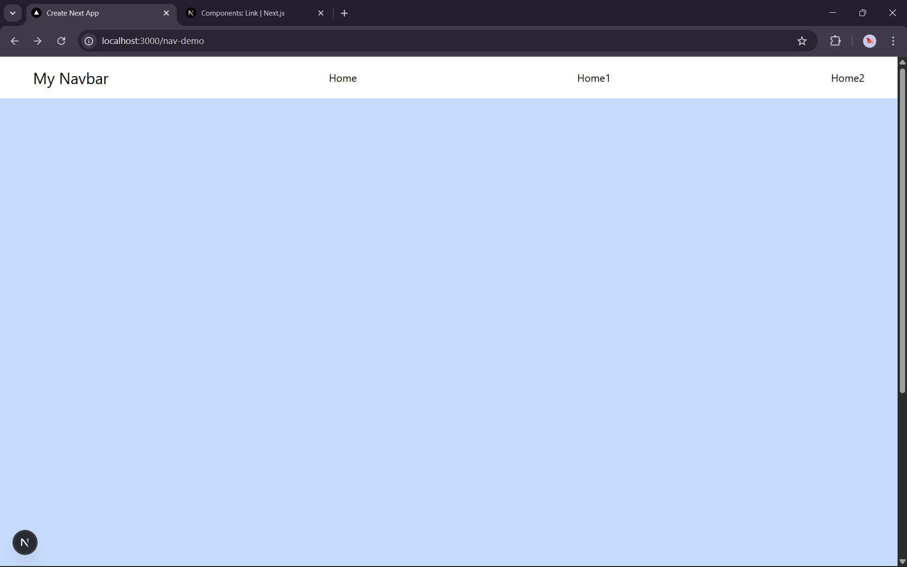
</div>
diatas sebelum scroll, dibawah setelah scroll
<div align="center">
    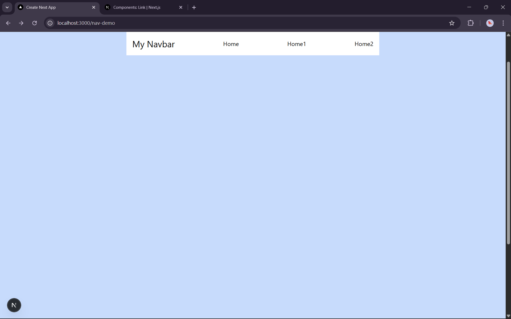
</div>

---

# Request apa lagi? demo besok jumat ya abis jumatan
